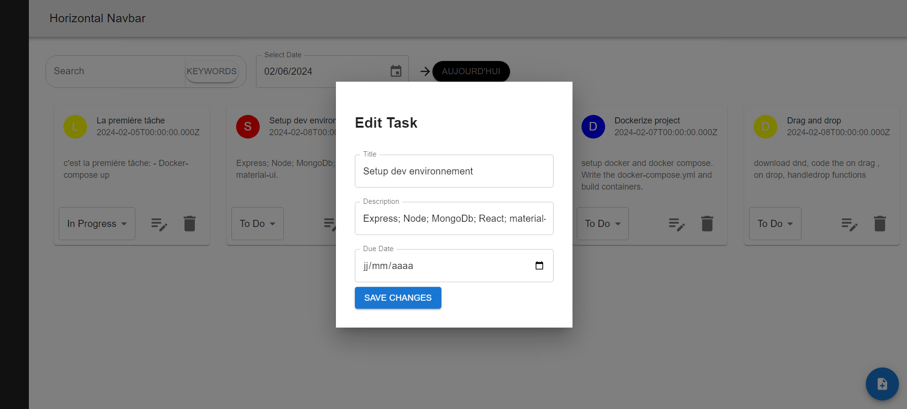

# Author
**Zaouga Amine**
# TestTechniquePlugandTel
MERN Project for a technical test with Plug and Tel . This App is a todo single-page web app applying these technologies:

- **MongoDB**: A NoSQL database used to store task data.
- **Express.js**: A web application framework for Node.js used for building the back-end API.
- **React.js**: A JavaScript library for building user interfaces used for the front-end.
- **Node.js**: A JavaScript runtime environment used for running server-side code.
- **docker-compose**: A tool for defining and running multi-container Docker applications used for Dockerization.

## Project Structure

The project is organized as follows:

- `back-end`: Contains the back-end code.
  - `__tests__`: Directory for unit tests.
  - `model`: Directory for defining MongoDB schemas and models.
  - `node_modules`: Directory for installed Node.js modules.
  - `routes`: Directory for defining API routes.
  - `validation`: Directory for input validation logic.
  - `DockerFile`: Dockerfile for building the back-end Docker image.
  - `jest.config.js`: Jest configuration file for unit testing.
  - `package-lock.json` and `package.json`: Files for managing Node.js dependencies.
  - `server.js`: Entry point for the back-end server.

- `front-end`: Contains the front-end code.
  - `node_modules`: Directory for installed Node.js modules.
  - `public`: Directory for static assets.
  - `src`: Directory for React components and application logic.
  - `.gitignore`: Gitignore file to specify intentionally untracked files.
  - `DockerFile`: Dockerfile for building the front-end Docker image.
  - `package-lock.json` and `package.json`: Files for managing Node.js dependencies.
  - `README.md`: Readme file for the front-end.

- `screenshots`: Directory for storing screenshots of the application.

- `docker-compose.yml`: Docker Compose configuration file for defining and running the application's Docker containers.

- `LICENSE`: License file for the project.

- `README.md`: Readme file for the project.

This is the visual representation:

TestTechniquePlugandTel
│ README.md
│ LICENSE
│ docker-compose.yml
│
├── back-end
│ │ DockerFile
│ │ jest.config.js
│ │ package-lock.json
│ │ package.json
│ │ server.js
│ │
│ ├── tests
│ │ │ createTask.test.js
│ │ │
│ ├── model
│ │ │ task.js
│ │ │
│ ├── routes
│ │ │ taskRoutes.js
│ │ │
│ └── validation
│ │ taskValidationSchema.js
│ │
├── front-end
│ │ DockerFile
│ │ package-lock.json
│ │ package.json
│ │ README.md
│ │
│ ├── node_modules
│ │ │ [Ignored - Not Shown]
│ │ │
│ ├── public
│ │ │ [Ignored - Not Shown]
│ │ │
│ ├── src
│ │ │ App.css
│ │ │ App.js
│ │ │ App.test.js
│ │ │ index.css
│ │ │ index.js
│ │ │ reportWebVitals.js
│ │ │ setupTests.js
│ │ │
│ ├── components
│ │ ├── cardItems
│ │ │ │ CardComponent.jsx
│ │ │ │
│ │ ├── modals
│ │ │ │ CreateTaskModal.jsx
│ │ │ │ EditTaskModal.jsx
│ │ │ │
│ │ ├── Navbars
│ │ │ │ HorizentalNavbar.jsx
│ │ │ │ VerticalNavbar.jsx
│ │ │ │
│ │ ├── search
│ │ │ │ SearchComponent.jsx
 

## Screenshots

Here are some screenshots of the application:


*The Todo App home page*


*Task creation modal form*


*task modification*


*search by date input*


*Change the status by selecting from the list*

## Usage

To run the application, make sure you have Docker installed on your system. Then, follow these steps:

1. Clone this repository to your local machine.
2. Navigate to the project directory.
3. Open a terminal and run the following command to start the containers:

```bash
docker-compose up --build

**Start Containers**

```bash
docker-compose start

##Example of task json object :
    {
        "_id": "65c129d8306ae432cd1e91de",
        "title": "La premiére tâche",
        "description": "c'est la premiére tâche: - Docker-compose up",
        "dueDate": "2024-02-05T00:00:00.000Z",
        "status": "In Progress",
        "order": 1,
        "__v": 0
    }
# API Endpoints

- **Create a new task:** `POST /api/tasks`
- **Get all tasks sorted by order:** `GET /api/tasks`
- **Get a single task by ID:** `GET /api/tasks/:id`
- **Update the status of a task by its ID:** `PUT /api/tasks/status/:id`
- **Update a task by ID:** `PUT /api/tasks/:id`
- **Delete a task by ID:** `DELETE /api/tasks/:id`
- **Filter tasks by date:** `GET /api/tasks/by-date/:date`
- **Filter tasks by status:** `GET /api/tasks/by-status/:status`
- **Search tasks by keyword in title and description:** `GET /api/tasks/search/:keyword`
- **Switch the order attribute between two tasks:** `PUT /api/tasks/switch-order/:id`
**check taskRoutes.js file to see the APIs code snippets**

